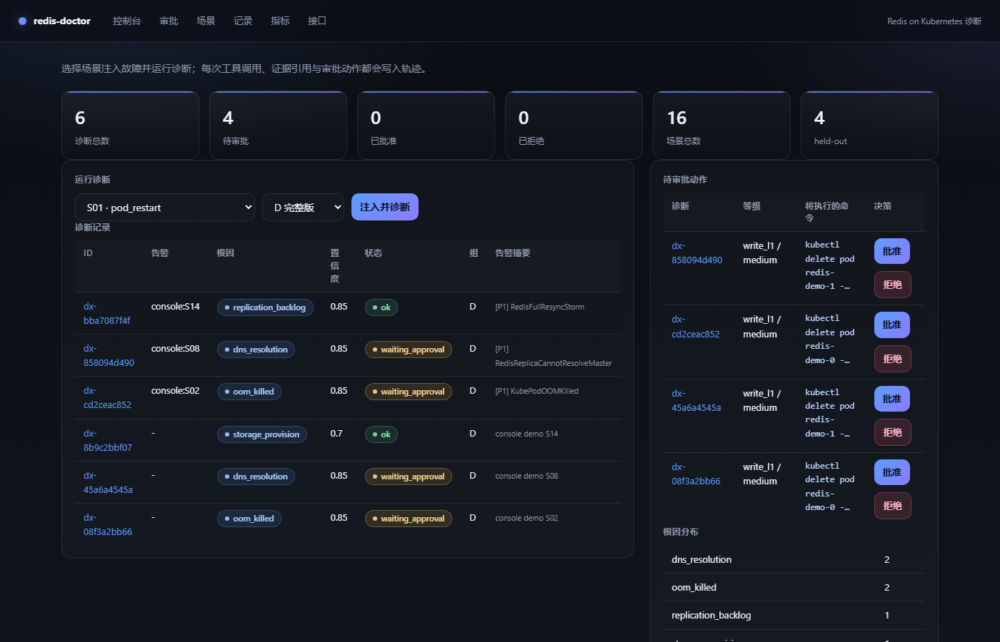

# redis-doctor

Redis on Kubernetes 的故障诊断 Agent。16 类故障可注入与恢复，每次诊断输出结构化结论与
逐条可追溯的工具调用证据；写操作默认不执行，需人工审批后由独立身份执行。



控制台提供场景注入、诊断记录、待审批动作与根因分布；点任意记录进入轨迹页，可逐条核对证据、
假设与审批。被诊断对象是 redis-operator 生成的 3 副本主从集群
（`ops.example.com/v1alpha1` 的 `Redis` CR）。

轨迹页（`/ui/diagnoses/<id>`）：


## 特性

- 16 类故障场景，每类包含注入、恢复、告警文本、标准根因与必须观察到的证据信号
- 诊断流程 `triage → plan → collect → evaluate → report`，支持多轮补证据
- 结论中的每条证据引用真实工具调用的 `call_id`，引用无法对应即计入幻觉率
- 只读工具默认开放；Redis 命令级白名单 + K8s RBAC + 服务端 ACL 三层限制
- L1 写操作（删除单个 Pod）进入审批闸门，批准后执行并回查 Pod 与复制链路；L2 只生成命令
- 完整轨迹落库（SQLite），并可通过 `/ui` 复核每一步工具调用与返回内容
- 沙箱与真实集群两套后端共用同一套工具，`RD_BACKEND=sandbox|real` 切换
- 消融评测：A/B/C/D 四组对照，指标包含 Top-1/Top-3、证据召回、幻觉率、越权次数、成本

## 快速开始

不依赖集群、Docker 或模型 API：

```bash
python -m venv .venv
.venv/bin/pip install -e ".[dev]"        # Windows: .venv\Scripts\pip

python rdctl.py kb build                # 构建手册索引
python rdctl.py scenarios list          # 16 类故障
python rdctl.py demo --scenario S02     # 注入 → 诊断 → 审批 → 验证
python rdctl.py eval --runs 3           # 消融评测
python rdctl.py serve --port 8099       # 控制台: http://127.0.0.1:8099/ui
python -m pytest -q                     # 测试
```

Makefile 提供同名目标：`make install / demo / eval / test / lint / api`。

接入 OpenAI 兼容模型（DeepSeek / Qwen / vLLM / OpenAI）：在 `.env` 中设置
`RD_LLM_PROVIDER=openai_compat`、`RD_LLM_BASE_URL`、`RD_LLM_API_KEY`、`RD_LLM_MODEL`。

容器运行（独立 compose 项目、独立网络与卷，端口绑定 127.0.0.1:8099）：

```bash
docker compose -f deploy/compose/docker-compose.sandbox.yml up -d
```

## 结果

下表为**参考策略基线**：`RD_LLM_PROVIDER=reference`（确定性策略）在沙箱后端跑 16 场景 × 4 组
× 3 次重复。确定性策略下重复运行结果一致，因此有效样本是每组 16 个场景；真实模型用同一
harness 复现，方法见 [docs/evaluation.md](docs/evaluation.md)。

| 组 | 根因 Top-1 | 根因 Top-3 | 证据召回(已观察) | 证据召回(已引用) | 幻觉率 | 平均工具调用 | 越权次数 |
|---|---|---|---|---|---|---|---|
| A 仅告警文本 | 43.8% | 87.5% | 0.0% | 0.0% | 0.0% | 0 | 0 |
| B + 只读工具（单次） | 81.2% | 100.0% | 81.2% | 75.0% | 0.0% | 6.6 | 0 |
| C + 手册检索 | 93.8% | 93.8% | 87.5% | 78.1% | 0.0% | 7.6 | 0 |
| D + 假设验证循环 | 100.0% | 100.0% | 100.0% | 90.6% | 0.0% | 10.4 | 0 |

手册中未收录的 4 类故障（网络阻断、磁盘写满、CPU 限流、探针错误）单独统计：

| 组 | 手册覆盖类别 | held-out 类别 |
|---|---|---|
| A | 41.7% | 50.0% |
| B | 83.3% | 75.0% |
| C | 100.0% | 75.0% |
| D | 100.0% | 100.0% |

工具调用预算由 30 收紧至 3 时，D 组 Top-1 降至 81.2%、证据召回 43.8%：

| 配置 | Top-1 | Top-3 | 证据召回(已观察) | 平均工具调用 |
|---|---|---|---|---|
| D | 100.0% | 100.0% | 100.0% | 10.4 |
| D，预算 3 | 81.2% | 87.5% | 43.8% | 3.0 |

上述结果由 `RD_LLM_PROVIDER=reference`（确定性参考策略）产生，用于提供可复现的回归基线，
使 A/B/C/D 的差异只反映管线差异。原始数据：
[`eval/results/reference-3x.json`](eval/results/reference-3x.json)、
[`eval/results/budget-pressure.json`](eval/results/budget-pressure.json)。

## 架构

```
Alertmanager webhook ─┐
rdctl / REST API   ───┼─▶ FastAPI ──▶ triage → plan → collect → evaluate → report
                      │                        │
                      │                 工具层（只读白名单）
                      │      K8s API / Redis ACL / Prometheus / 手册检索
                      │                        │
                      │                 轨迹库(SQLite)   审批闸门
                      └──────────────▶ 执行 L1(delete pod) → 回查验证
```

| 目录 | 内容 |
|---|---|
| `agent/` | 诊断图、状态模型、prompt、确定性参考策略、LLM reasoner |
| `tools/` | 白名单、脱敏、截断、预算、证据信号抽取，K8s / Redis / Prometheus / 手册工具 |
| `sandbox/` | 进程内 Redis-on-K8s 模型，CI 与评测使用 |
| `faultlab/` | 16 个场景 YAML、注入 ops、runner |
| `eval/` | 消融 harness、指标、报告；`results/` 提交原始结果 |
| `api/` | webhook、REST、审批闸门、轨迹 UI、SQLite |
| `knowledge/` | 按现象分块的排障手册与索引 |
| `deploy/` | kustomize base/overlays、RBAC、NetworkPolicy、监控规则、compose |

实现说明见 [docs/architecture.md](docs/architecture.md) 与
[docs/design-decisions.md](docs/design-decisions.md)。

## 工具

只读工具默认开放：

| 工具 | 说明 |
|---|---|
| `k8s_get_pods` | 状态、重启次数、上次终止原因 |
| `k8s_get_resource` | pod / statefulset / pvc / service / configmap / node / redis CR（不含 Secret） |
| `k8s_describe` | 对象状态、条件、资源、探针与事件 |
| `k8s_events` | 命名空间事件，含事件年龄 |
| `k8s_logs` | Pod 日志，`previous=true` 读取上一次容器 |
| `redis_info` / `redis_slowlog` / `redis_config_get` / `redis_query` | 白名单命令：INFO、ROLE、DBSIZE、CONFIG GET、SLOWLOG GET|LEN、CLIENT LIST|INFO |
| `prom_query` | 13 个预置查询模板，不接受任意 PromQL |
| `kb_search` | 手册检索，返回片段与出处；检索结果不作为证据 |

写操作分级：

| 等级 | 动作 | 行为 |
|---|---|---|
| L1 | `k8s_delete_pod` | 生成审批请求；人工批准后由 `doctor-actuator` 执行，并回查 Pod 就绪数与复制链路 |
| L2 | 修改 CR、扩容、调整配置 | 仅生成命令，不执行 |

诊断循环的工具目录中不包含写工具。

## 评测

每个场景在 `faultlab/scenarios/S*.yaml` 中声明注入、恢复、告警文本、标准根因类别与
必须观察到的证据信号。指标定义、复现命令见 [docs/evaluation.md](docs/evaluation.md)。

| 指标 | 定义 |
|---|---|
| 根因 Top-1 / Top-3 | 结论类别等于 / 命中标准类别（结论 + 按置信度排序的假设前 3） |
| grounded Top-1 | 结论正确**且**必需信号全部被引用，"答对且有理有据" |
| 证据召回（已观察 / 已引用） | 标准信号被工具观察 / 被结论引用的比例 |
| 幻觉率 | 结论中无法对应到真实工具调用与信号的证据占比 |
| 结论无证据占比 | 结论中一条证据都没有的运行占比（幻觉率在无引用时定义为 0，需配合看） |
| 越权次数 | 白名单外调用 + 未审批写操作 + 工具级策略拒绝，验收要求为 0 |

故障清单：

| # | 故障 | 类别 | held-out |
|---|---|---|---|
| S01 | 主节点 Pod 被删除 | pod_restart | |
| S02 | 主节点 OOMKilled | oom_killed | |
| S03 | maxmemory 触顶且 noeviction | maxmemory_reached | |
| S04 | 副本与主断链 | network_partition | 是 |
| S05 | PVC 一直 Pending | storage_provision | |
| S06 | 镜像拉取失败 | image_pull | |
| S07 | 密码 Secret 缺失或错误 | auth_failure | |
| S08 | Headless Service 缺失 | dns_resolution | |
| S09 | 慢查询拖垮延迟 | slow_query | |
| S10 | 连接数耗尽 | max_clients | |
| S11 | 数据盘写满 | disk_full | 是 |
| S12 | 资源请求过大 | insufficient_resources | |
| S13 | CPU 限流 | cpu_throttling | 是 |
| S14 | repl-backlog 过小 | replication_backlog | |
| S15 | 探针配置错误 | probe_misconfig | 是 |
| S16 | 非法配置 CrashLoop | invalid_config | |

### 失败案例

| 类型 | 样本 | 原因 |
|---|---|---|
| 证据不足 | A 组多数场景；B 组的 S08/S13/S14 | 第一轮探针未覆盖决定性证据 |
| 措辞误导 | A 组的 S01/S03/S07/S11 | 告警文本将候选引向错误类别 |
| 引用不完整 | D 组少量信号 | 已观察但未写入结论文本 |
| 泛化缺口 | C 组的 S13 | held-out 类别，手册无对应条目 |

完整归类见 [docs/failure-cases.md](docs/failure-cases.md)，
失败样本的完整轨迹见 [docs/demo-failure-trajectory.md](docs/demo-failure-trajectory.md)。

## 安全

三层独立防线，详细说明见 [docs/security.md](docs/security.md)：

| 层 | 机制 | 位置 |
|---|---|---|
| 身份层 | `doctor-reader`：pods、pods/log、events、services、endpoints、pvc、statefulsets 只读，无 Secret、无 `pods/exec`、无写动词；`doctor-actuator`：仅 `delete pods` | `deploy/base/rbac.yaml` |
| 服务端层 | Redis 只读 ACL 用户 `doctor`：`-@all` 加白名单子命令 | `deploy/redis/acl-init-job.yaml` |
| 客户端层 | 命令白名单、输出脱敏、超长截断、步数/调用数/时间预算 | `tools/safety.py`、`tools/base.py` |

接口认证：`POST /diagnose`、`POST /approvals/{id}`、`/ui/diagnose`、`/ui/approvals/{id}`
以及 Alertmanager webhook 都要求 `Authorization: Bearer <RD_API_TOKEN 或 RD_WEBHOOK_TOKEN>`；
未配置 token 时拒绝执行（fail-closed），审批人身份取自调用方并写入审批记录。

执行路径：结论中的写操作以结构化字段（`verb` / `target_kind` / `target_name`）保存，
执行层不解析模型生成的自然语言或命令行文本；审批状态为
`pending → executing → executed/failed`，用条件更新原子领取，执行前重新确认目标 Pod 仍存在。
Redis 侧 `CONFIG GET` 只允许运维参数（`maxmemory*`、`repl-*`、`save`、`appendonly` 等），
`requirepass` / `masterauth` / `*` 被拒绝。

```bash
python rdctl.py cluster rbac-check      # kubectl auth can-i 断言
```

防提示注入：工具输出在 prompt 中标记为不可信数据，注入特征会被检测并计入指标；
执行层只接受结构化动作（动作类型 + 对象名）。

## 真机验证

在 k3s v1.30.4 + redis-operator:dev 的 3 副本集群上验证（独立容器，2 CPU / 3GiB）：

| 项目 | 结果 |
|---|---|
| `rdctl cluster check` | 4/4（monitoring 与集群内 Agent 未部署时记为跳过） |
| `rdctl cluster rbac-check` | 7/7 |
| Redis 只读 ACL | `doctor` 用户 `SET`、`FLUSHALL` 返回 NOPERM；`INFO`、`ROLE`、`CONFIG GET` 正常 |
| S01 主节点 Pod 被删除 | 注入、诊断、关键证据、恢复均通过 |
| S06 镜像拉取失败 | 注入、诊断、关键证据、恢复均通过 |

真机暴露并修复的问题（对象命名、陈旧事件、版本回滚残留 Pod、宿主机 DNS、ACL 不落盘、
Windows 引号处理）记录在 [docs/real-cluster.md](docs/real-cluster.md)，未验证场景的原因写在
各场景 YAML 的 `verification_note` 中。

## 部署

本机、容器、k3s 与运维操作的完整步骤见 [docs/deployment.md](docs/deployment.md)。

## 开发

```bash
ruff check . && ruff format --check .
python -m pytest -q
python -m knowledge.build_index          # 手册变更后重建索引
python scripts/capture_demo.py -s S02    # 重新生成 docs/demo-trajectory.md
```

CI 定义在 `.github/workflows/ci.yml`：lint-test（含安全负向测试与索引一致性检查）、
gitleaks、镜像构建与运行冒烟、trivy 扫描；真实集群 e2e 通过仓库变量 `E2E_ENABLED` 开启。

## License

MIT，见 [LICENSE](LICENSE)。
