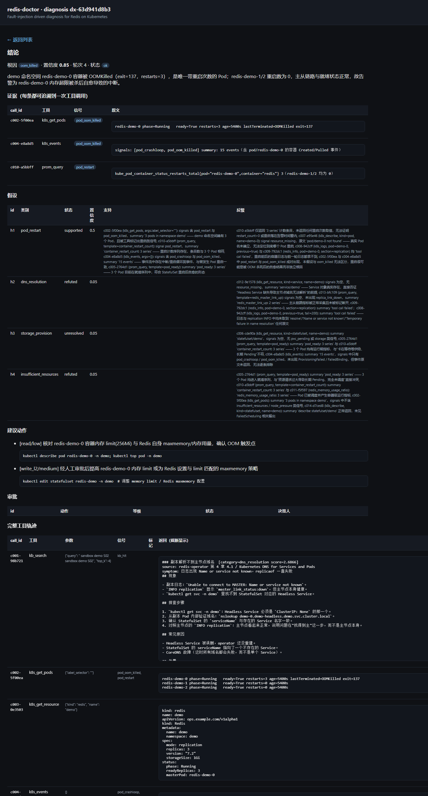
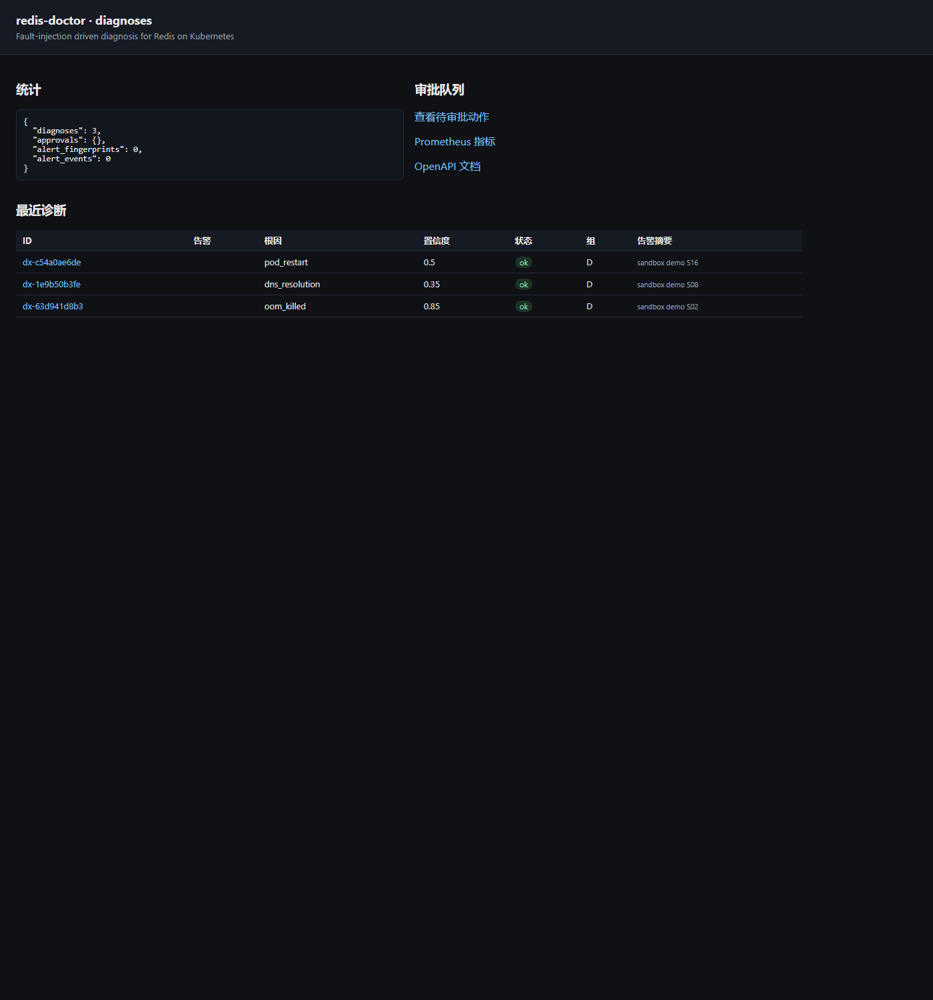

# 演示与截图

## 截图

轨迹页（`/ui/diagnoses/<id>`）：结论、逐条证据、假设的支持与反驳、建议动作、审批状态、完整工具轨迹。



诊断列表（`/ui`）：



两张图都是真实运行的输出，不含手工修饰。复现方式：

```bash
RD_DATA_DIR=data/shots python rdctl.py serve --port 8099 &
for s in S02 S08 S16; do
  curl -s -X POST localhost:8099/diagnose -H 'Content-Type: application/json' \
    -d "{\"alert_text\":\"sandbox demo $s\",\"sandbox_scenario\":\"$s\",\"variant\":\"D\"}"
done
# 用浏览器打开 http://127.0.0.1:8099/ui ，或直接无头截图：
msedge --headless=new --window-size=1400,2600 \
  --screenshot=docs/screenshots/ui-trajectory.png \
  http://127.0.0.1:8099/ui/diagnoses/<id>
```

## 终端实录

`python scripts/capture_demo.py --scenario S02 --variant D` 会把一次真实运行的完整输出写进
[demo-trajectory.md](demo-trajectory.md)；一次失败样本在
[demo-failure-trajectory.md](demo-failure-trajectory.md)（B 组看 S08，判成 network_partition）。

## 常用命令

```bash
python rdctl.py scenarios list                 # 16 类故障
python rdctl.py demo --scenario S02            # 单场景：注入 → 诊断 → 审批 → 验证
python rdctl.py eval --runs 3                  # 消融评测
python rdctl.py serve --port 8099              # Web UI
python rdctl.py cluster check                  # 真机组件检查
python rdctl.py cluster rbac-check             # RBAC 断言
```
